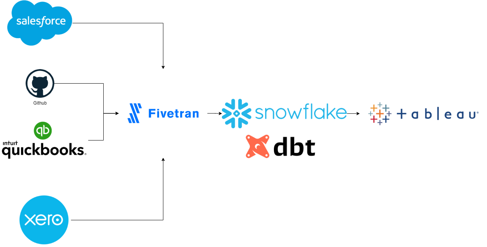

# dbt five tran package testing

## Architecture

## github
[dbt fivetran github models](https://github.com/fivetran/dbt_github)
developed for github org accounts. Couldnt use with my personal account due to missing data on reviewers ect.

## S3

## Salesforce
[dbt fivetran salesforce models](https://github.com/fivetran/dbt_salesforce/tree/v0.3.0/)

## Xero
No models from dbt

## Quickbooks
[dbt fivetran quickbooks models](https://hub.getdbt.com/fivetran/quickbooks/latest/)

## Jira
[dbt fivetran jira models](https://github.com/fivetran/dbt_jira/tree/v0.1.3/)